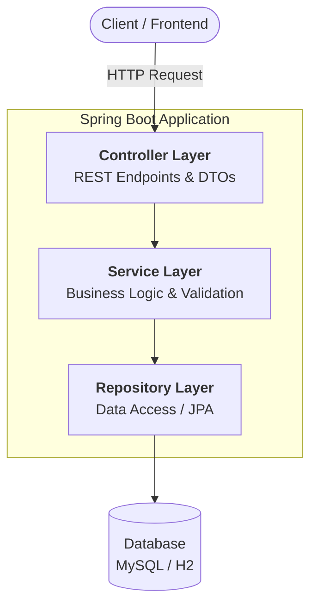
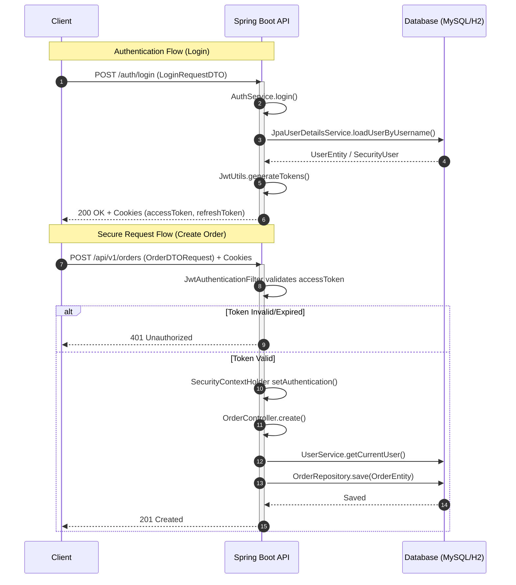
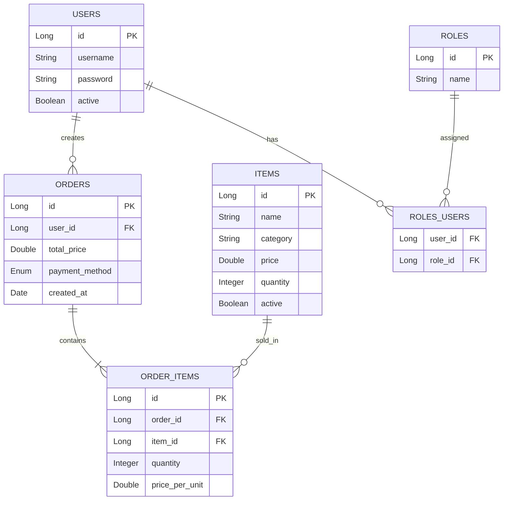

# 🍸 BarTrack Backend


---

## 📌 Project Overview

**BarTrack Backend** is a robust RESTful API designed to streamline bar inventory management and sales operations. It provides a secure, scalable foundation for tracking items, managing orders, and handling role-based access control.

The current version represents a **Minimum Viable Product (MVP)** with a clean, layered architecture prepared for enterprise-level scaling.

---

## 🏗️ Architecture & Design

### High-Level Architecture

The project follows a classic **3-tier layered architecture** to ensure separation of concerns, high maintainability, and ease of testing.



---

### Request Lifecycle & Security Flow

Authentication is handled via JWT stored in HttpOnly Cookies, providing a secure stateless session management.



---

## 🎯 MVP Scope

| Admin Permissions        | User Permissions     | Future (Post-MVP)      |
| ------------------------ | -------------------- | ---------------------- |
| ✅ Full CRUD for items   | ✅ View active items | 🧪 Cocktail recipes    |
| ✅ View all orders       | ✅ Create orders     | 📦 Ingredient tracking |
| ✅ Manage system catalog | ✅ View own orders   | 📊 Sales analytics     |

---

## 🗄️ Database Model



---

## 🛠️ Technology Stack

### Core

- Java 21 & Spring Boot 3.x

- Spring Security (JWT + HttpOnly Cookies)

- Spring Data **JPA** (Hibernate)

### Infrastructure & Docs

- MySQL (Production) / H2 (Testing)

- Swagger / OpenAPI 3 (Springdoc)

- Docker & Maven

### Testing

- JUnit 5, Hamcrest

- Spring Security Test

---

## 🧪 Testing & Coverage

The project follows a comprehensive testing strategy to ensure reliability and security:

- **Unit Testing:** Focused on business logic validation in `Service` layers.
- **Integration Testing:** Each `Controller` is covered with integration tests using `@SpringBootTest` and `MockMvc`.
- **Security Testing:** Authentication and Role-Based Access Control (RBAC) are verified via `Spring Security Test`.
- **Database Testing:** H2 in-memory database is used for fast and isolated test execution.

### Test Coverage Summary

> [!IMPORTANT]
> **Current Status:** All controllers and core services are covered.
> 

---

## ⚙️ Installation & Setup

### 1. Clone the repository:

```bash
git clone [https://github.com/YOUR_USERNAME/bartrack-backend.git](https://github.com/YOUR_USERNAME/bartrack-backend.git)
```

### 2. Configure Environment:

Update application.properties or set env variables for jwt.secret and database credentials.

### 3. Build & Run:

```bash
mvn clean package
mvn spring-boot:run
```

### 4. Docker Setup:

```bash
docker build -t bartrack-backend .
docker run -p 8080:8080 bartrack-backend
```

### 📖 API Documentation:

Once the app is running, visit http://localhost:8080/swagger-ui.html

> This project uses **HttpOnly Cookies** for JWT storage. Since Swagger UI has known limitations with automatic cookie handling in some browser environments, you may experience `401 Unauthorized` errors even after a successful login.

## 🧠 Design Principles

- SOLID & DRY principles
- Clean Architecture (Layered)
- DTO Pattern for request/response decoupling
- Centralized Exception Handling
- Security-First development

---
